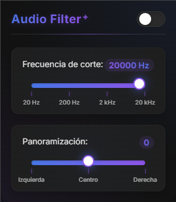

# Audio Filter - Chrome Extension



## Overview

Audio Filter is a lightweight Chrome extension that allows users to apply a low-pass filter to all audio sources played in the browser. It's particularly useful for late-night browsing or for users who are sensitive to high-frequency sounds.

By applying a low-pass filter, the extension reduces the intensity of high-frequency sounds (like harsh sibilants, certain music elements, or high-pitched noises) while preserving the lower frequencies, resulting in a more comfortable listening experience.

## Features

- **Simple Toggle On/Off**: Easily enable or disable the audio filter with a single click
- **Adjustable Cutoff Frequency**: Fine-tune the filter by adjusting the cutoff frequency (from 20 Hz to 20 kHz)
- **Real-time Filtering**: Changes apply instantly to all audio and video elements on all tabs
- **Persistent Settings**: Your preferences are saved and applied across browser sessions
- **Low Resource Impact**: Minimal performance impact through efficient audio processing

## Installation

### Manual Installation (Developer Mode)
1. Download or clone this repository
2. Open Chrome and navigate to `chrome://extensions/`
3. Enable "Developer mode" at the top-right corner
4. Click "Load unpacked" and select the extension directory
5. The extension is now installed and ready to use

## Usage

1. Click on the Audio Filter icon in your Chrome toolbar to open the popup interface
2. Toggle the switch to enable or disable the filter
3. Use the slider to adjust the cutoff frequency:
   - Lower values (left): Only very low frequencies pass through
   - Higher values (right): Most frequencies pass through
   - Recommended starting point: Around 2000 Hz for a balanced effect

## How It Works

Audio Filter uses the Web Audio API to create a biquad filter (specifically a low-pass filter) and applies it to all `<audio>` and `<video>` elements on the page. The extension:

1. Intercepts audio output from media elements
2. Routes the audio through a biquad filter node
3. Adjusts the filter's cutoff frequency based on user settings
4. Delivers the filtered audio to the output destination

## Technical Details

- Built with vanilla JavaScript
- Uses Chrome's storage API for saving preferences
- Implements the Web Audio API for audio processing
- Runs content scripts that dynamically modify the audio context on each page
- Uses background service worker for cross-tab communication

## Project Structure

```
audio-filter/
├── background.js      # Background service worker for message handling
├── content.js         # Content script that applies filter to web page audio
├── popup.html         # Extension popup interface markup
├── popup.css          # Styling for the popup interface
├── popup.js           # Logic for the popup UI and user interactions
├── manifest.json      # Extension configuration and permissions
└── icons/             # Extension icons in various sizes
    └── icon128.png    # Primary extension icon
```

## Browser Compatibility

This extension is designed for Chromium-based browsers:
- Google Chrome 76+
- Microsoft Edge 79+ (Chromium-based)
- Brave, Opera, and other Chromium browsers

## Privacy

Audio Filter respects your privacy:
- No data is collected or transmitted
- All processing happens locally in your browser
- No external dependencies or third-party services
- No permissions requested beyond what's necessary for functionality

## Contributing

Contributions are welcome! If you'd like to improve Audio Filter:

1. Fork this repository
2. Create a new branch for your feature (`git checkout -b feature/amazing-feature`)
3. Commit your changes (`git commit -m 'Add some amazing feature'`)
4. Push to the branch (`git push origin feature/amazing-feature`)
5. Open a Pull Request

## License

This project is licensed under the MIT License - see the LICENSE file for details.
